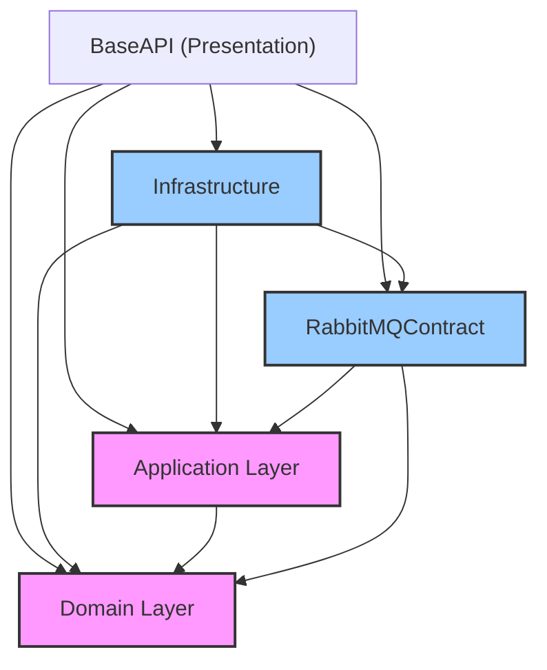

# Source Base Dotnet API

Tài liệu này mô tả chi tiết kiến trúc, các thành phần và hướng dẫn sử dụng source code của dự án Source Base Dotnet API.

## 1. Tổng Quan Kiến Trúc (Architecture Overview)

Dự án được xây dựng dựa trên kiến trúc **Clean Architecture** kết hợp với **CQRS** (Command Query Responsibility Segregation) sử dụng MediatR.

Kiến trúc tuân thủ **Dependency Rule**: các dependency chỉ hướng vào bên trong. Core Layer (Domain, Application) không phụ thuộc vào Infrastructure hay External Services.

### Sơ Đồ Phụ Thuộc (Dependency Graph)



### Các Layer Chính:

*   **BaseAPI (Presentation Layer)**:
    *   **Vai trò**: Entry point của ứng dụng.
    *   **Thành phần**: Controllers, Middleware, Configuration (DI, Serilog, JWT, Swagger).
    *   **Dependency**: Phụ thuộc vào tất cả các project khác để thực hiện Dependency Injection (wiring up).

*   **Application (Core Layer)**:
    *   **Vai trò**: Chứa business logic, use cases.
    *   **Thành phần**: CQRS Handlers (MediatR), DTOs, Validation, **Interfaces** (Abstractions) cho Infrastructure/Services.
    *   **Dependency**: Chỉ phụ thuộc vào `Domain`. **Không** phụ thuộc vào Infrastructure/Database/External libs.

*   **Domain (Core Layer)**:
    *   **Vai trò**: Trái tim của hệ thống.
    *   **Thành phần**: Entities, Value Objects, Enums, Constants, Domain Exceptions.
    *   **Dependency**: **Không** phụ thuộc vào bất kỳ layer nào khác.

*   **Infrastructure**:
    *   **Vai trò**: Triển khai các logic kỹ thuật, kết nối Database, File System, External Services.
    *   **Thành phần**:
        *   DBContext (EF Core), Repository Implementation, UnitOfWork.
        *   **EmailService**: Implement `IEmailSender`.
        *   **RedisService**: Implement `IRedisService`.
        *   **JwtService**: Implement auth logic.
        *   **GoogleDriveService**: External Storage.
    *   **Dependency**: Phụ thuộc vào `Application` (để implement interfaces), `Domain` và `RabbitMQContract`.

*   **RabbitMQContract**:
    *   **Vai trò**: Định nghĩa Consumers xử lý message từ Message Broker.
    *   **Dependency**: Phụ thuộc vào `Application` và `Domain`.

---

## 2. Project & Package Dependencies

| Project | Packages Chính | Mục Đích |
| :--- | :--- | :--- |
| **Domain** | `Microsoft.EntityFrameworkCore` | Attributes cho Entities. |
| | `Newtonsoft.Json` | Xử lý JSON. |
| | `MassTransit.RabbitMQ` | Messaging attributes/interfaces. |
| | `Microsoft.AspNetCore.Authentication.JwtBearer` | Auth related types. |
| | `HtmlSanitizer` | Security/Sanitization. |
| | `Serilog` | Logging abstractions. |
| **Application** | `MediatR` | Pattern CQRS. |
| | `Dapper` | Truy vấn đọc dữ liệu (Query side). |
| | `Elastic.Clients.Elasticsearch` | Search operations. |
| | `Microsoft.EntityFrameworkCore.SqlServer` | SQL Specifics (Limit usage here if possible). |
| **Infrastructure** | `Microsoft.EntityFrameworkCore.SqlServer` | SQL Server Provider. |
| | `Google.Apis.Drive.v3` | Giao tiếp Google Drive API. |
| | `StackExchange.Redis` | Redis Implementation. |
| **BaseAPI** | `AspNetCoreRateLimit` | Rate Limiting. |
| | `Serilog` | Logging. |
| | `Swashbuckle` / `Scalar` | API Documentation. |
| | `FluentValidation.AspNetCore` | Validation integration. |
| | `MaxMind.GeoIP2` | Geo Location functionality. |

---

## 3. RabbitMQ & Messaging

Dự án sử dụng **MassTransit** để làm việc với **RabbitMQ**.

### Cấu Hình
Cấu hình trong `appsettings.json` mapping vào `RabbitMQConfig`.

### Workflow
1.  **Application** gửi message thông qua `IPublishEndpoint` (của MassTransit) hoặc qua Bus abstraction.
2.  **RabbitMQContract** chứa các `Consumer` đăng ký nhận message từ Queue.
3.  **Dependency Injection**: Consumer được đăng ký tại `BaseAPI`.

---

## 4. Hướng Dẫn Setup & Chạy

1.  **Prerequisites**: SDK .NET 9, SQL Server, RabbitMQ, Redis.
2.  **Config**: Update connection strings trong `appsettings.json`.
3.  **Migration**:
    ```bash
    dotnet ef database update --project Infrastructure --startup-project BaseAPI
    ```
4.  **Run**: Set `BaseAPI` as Startup Project.

---
*Generated by Antigravity*
